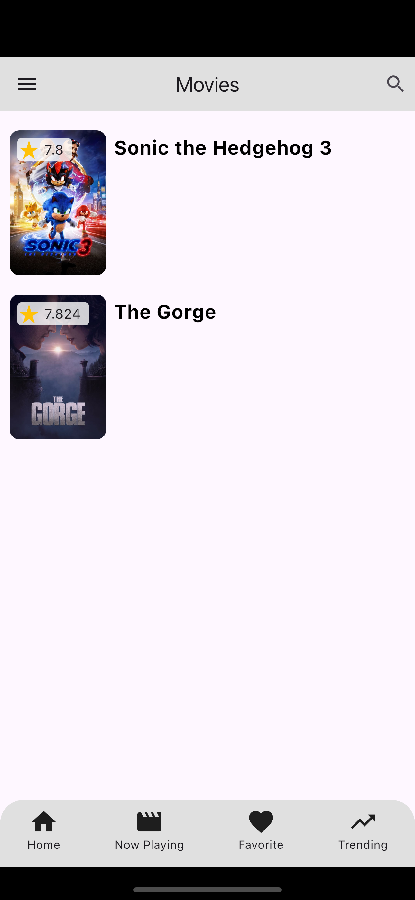

# 🎬 Movie App – A Flutter Application  

Movie App is a modern **Flutter** application that provides movie details using the **IMDb API**. It follows **clean architecture** principles and integrates secure storage, state management, and remote configuration to ensure **scalability, security, and efficiency**.  

## 🚀 Features  

- **State Management** – Implemented using **BLoC** for structured and predictable state handling.  
- **Local Database** – Uses **Hive** for fast and lightweight on-device storage.  
- **API Key & Token Management** – Dynamically managed using **Firebase Remote Config** for secure and hassle-free updates.  
- **Secure Storage** – Encrypts and decrypts sensitive data (e.g., authentication tokens) using **Flutter Secure Storage**.  
- **Clean Architecture** – Organized using the **Repository Pattern**, making the app modular and easy to maintain.  
- **IMDb API Integration** – Fetches movie data such as trending movies, top-rated films, and detailed descriptions.  

## 🏗️ Tech Stack  

- **Flutter** – Cross-platform UI framework  
- **BLoC** – State management  
- **Hive** – Local database  
- **Firebase Remote Config** – API keys and authentication tokens  
- **Flutter Secure Storage** – Secure data encryption & decryption  
- **Dio** – HTTP client for API requests  

## 🏗 Project Architecture  

The project follows the **Clean Architecture** approach with the **Repository Pattern**, ensuring separation of concerns:  

```bash
lib/
├── core/                  # Core utilities (constants, themes, etc.)
├── data/                  
│   ├── models/            # Data models  
│   ├── repositories/      # API and database interactions  
├── domain/                
│   ├── entities/          # Business logic entities  
│   ├── usecases/          # Application use cases  
├── presentation/          
│   ├── blocs/             # BLoC state management  
│   ├── screens/           # UI screens  
├── utils/                 # Helpers (storage, encryption, etc.)
└── main.dart              # App entry point
```

## 🛠️ Setup & Installation  

### 1️⃣ Clone the Repository  
```sh
git clone https://github.com/muhammadimran021/FlutterMoviesDemoApp.git
cd movie-app
```

### 3️⃣ Configure Firebase
  - Add google-services.json (Android) and GoogleService-Info.plist (iOS).
  - Enable Remote Config in Firebase and add the necessary API keys.

### 4️⃣ Run the App
```sh
flutter run
```

## 📸 Screenshots

| Home  | Movie Detail's  | Movies |
|--------------|--------------|--------------|
|  |  |  |

| Favorite Movies  | Search Movie  |
|--------------|--------------|
|  |  |

### 📜 License
This project is licensed under the MIT License – feel free to use and modify it.

